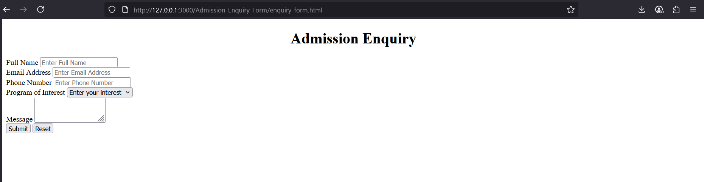

# Admission_Enquiry_Form
## Date:

## Objective:
To design a simple Admission Enquiry Form using basic HTML that collects student details such as name, contact, program of interest, and a message for further communication.

## Tasks:
#### 1. Set Up the HTML Structure:
Use ```<!DOCTYPE html>```, ```<html>```, ```<head>```, and ```<body>``` tags to define the document structure.
Set the ```<title>``` as "Admission Enquiry Form".

#### 2. Add a Page Heading:
Use ```<h1>``` to title the page as “Admission Enquiry”.

#### 3. Create the Form Layout:
Use the ```<form>``` tag to wrap all input elements. Set method="post" for structure.

#### 4. Add Input Fields:
Include the following fields using appropriate HTML elements:

Full Name

Email Address

Phone Number 

Program of Interest 

Message

#### 5. Add Submit and Reset Buttons:
Use submit and reset at the bottom of the form.

#### 6. Use HTML-only:
No CSS or JavaScript is to be included. Focus on structure and accessibility.

## HTML Code:
```
<!DOCTYPE html>
<html lang="en">
<head>
    <meta charset="UTF-8">
    <meta name="viewport" content="width=device-width, initial-scale=1.0">
    <title>Admission Enquiry Form</title>
</head>
<body>
    <h1 align="center">Admission Enquiry</h1>
    <form method="post">
        <label>Full Name</label>
        <input type="text" placeholder="Enter Full Name" required>
        <br>
        <label>Email Address</label>
        <input type="email" placeholder="Enter Email Address">
        <br>    
        <label>Phone Number</label>
        <input type="tel" placeholder="Enter Phone Number">
        <br>    
        <label>Program of Interest</label>
        <select
        <option value="B.Tech">B.tech</option>
        <option value="B.E">B.E</option>
        <option value="M.Tech">M.Tech</option>
        <option value="Enter your interest" selected="true">Enter your interest</option>
        </select>
        <br>
        <label>Message</label>
        <textarea col="3" rows="3"></textarea>
        <br>
        <input type="submit" value="Submit">
        
        <input type="reset" value="Reset">
    </form>
</body>
</html>
```

## Output:


## Result:
An Admission Enquiry Form using HTML that collects student details and message for institutional follow-up is successfully created using semantic and readable HTML.
